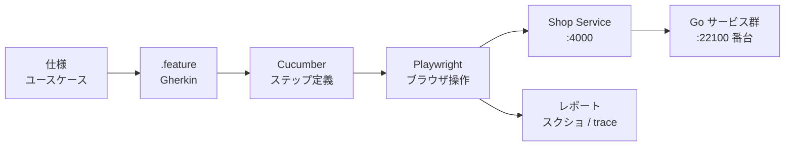

# E2E サンプル実装 — Gherkin + Cucumber + Playwright

オンラインショップを題材に、E2E テストを Gherkin で書くと開発がどう変わるかを、動く形で示すためのリポジトリ。

「E2E に工数を割く価値があるのか」をチームや PM に説明するとき、口頭の理屈だけではなかなか通らない。動くシナリオとテストを見せたほうが早い、という発想で作っている。

**現状: バックエンドは submodule として揃ったが、E2E のテストコードはまだ書いていない。** `e2e/` には `.gitKeep` しか入っていない。

最終更新: 2026-08-27

## この README の読み方

[なぜ E2E を書くのか](#なぜ-e2e-を書くのか) が本体で、導入を判断する材料はこの章に集めてある。説得材料として読むならここだけでいい。

それ以降（構成・Getting Started・シナリオの書き方）は手を動かすときに引く参照用の章。

## 何を作っているか

題材はオンラインショップ。商品を選び、カートに入れ、決済して購入するまでを最小限で通す。

バックエンドは別リポジトリの [go_microservice_example](https://github.com/makoto-developer/go_microservice_example) を `backend/` に git submodule として取り込んで使う。Go のマイクロサービス 12 個と、それを gRPC で呼ぶ Phoenix 製の Web UI が入っていて、E2E の対象はこの Web UI（`backend/web/shop_mall_web`、ポート 4000）。

E2E のテストコードは、このリポジトリの `e2e/` に置く。テスト対象は submodule、テストは本体、という分け方をしている。テスト対象のバージョンが submodule の commit で固定されるので、「昨日は通ったのに今日落ちる」を調べるときに変数を1つ減らせる。

## なぜ E2E を書くのか

### 効くところ

| | 何が起きるか |
|:--|:--|
| 品質 | 自動化した範囲の仕様が実行可能な形で残り、そこへのデグレを機械が見つける |
| 仕様の発見 | シナリオを書く工程そのものが、濃い仕様レビューになる |
| 教育 | 新しく入った人がシナリオを読めば、主要なユースケースに追いつける |
| 速度 | 繰り返しの手動確認が減り、リファクタリングに踏み切れる |

このうち「仕様の発見」と「教育」は、正確には Gherkin で仕様を書くこと（BDD）の効果で、ブラウザを動かす E2E でなくても得られる。ブラウザ E2E でなければ拾えないのは、画面・サービス間連携・設定をまたいで初めて壊れる種類の不具合のほう。分けて理解しておくと、あとで「API テストで十分では」と言われたときに答えられる。

**仕様が実行可能な形で残る。** トップダウンでシナリオを書くと、プロダクトの仕様とユースケースを自分の言葉で説明することになる。この工程を通ると理解が一段深くなり、UI の粗さや仕様の抜けが表に出てくる。書き上がったシナリオは、新機能を設計するときの考慮漏れチェックにも、障害報告で「このケースを想定していなかった」と説明するときにも使える。

**シナリオを書く工程が仕様レビューになる。** 作った本人でさえ気づいていなかったパターンや考慮漏れが出てくる。ここが E2E のいちばん割に合う部分で、テストが1本も動く前から価値が出る。プロダクトに精通した開発者が増えるという副作用もあって、これは生産性にそのまま効く。

**新しく入った人がシナリオを読めば追いつける。** 仕様書は古びても誰も気づかないが、期待結果まで書いた E2E は、実装とずれたぶんが落ちる形で見える。落ちるドキュメントは直される。ただしシナリオが表せるのは自動化した範囲だけで、業務用語や例外の背景までは別に要る。

**リファクタリングに踏み切れる。** コードには定期的に手を入れる必要があるが、前後でデグレしていないかの確認が重い。E2E があると、自動化した範囲についてはこの確認が実行1回に縮む。MR ごと・日次で回せば、その範囲のデグレは混入した当日に見つかる。UX が競争条件になっている以上、ここが速いことは顧客にも開発者にも効く。

### つらいところ

銀の弾丸ではない。導入前に覚悟しておくことが5つある。

**立ち上がりが遅い。** いちばん重いのはシナリオの整理で、テストコードを書く前の段階で時間が溶ける。どのフローを対象にするか、期待結果を何にするか、テストデータをどう用意するか。ここを合意するのが初期コストの実体で、「システムテストがあるからいい」「小さいシステムにそこまで要らない」と言われて止まりやすいのもここ。

Gherkin はこの重さを軽くする規格ではあるが、期待しすぎないほうがいい。Cucumber が出してくれるのは未定義ステップの雛形（スニペット）までで、ブラウザ操作・待機・データ準備・検証は自分で書く。それでも、ユースケースを言葉にしていくと埋めるべき穴が並ぶ、という関係が見えてくると作業自体が楽しくなる（個人談）。作った人さえ気づかなかったパターンに気づき、だんだん完成形に近づいていく工程は病みつきになる。

**すべてのパターンは自動化できない。** どうしても再現できない、あるいは自動化が費用に見合わないシナリオは残る。ここで完璧を求めると、とくに初期段階では挫折するし、いつまで経っても完成しない。E2E に終わりはない。それでも、始めた時点で得られるものがある。

**壊れるし、遅い。** 実ブラウザを動かすので、単体テストと比べて実行時間は桁で違う。非同期処理・共有データ・外部依存・待機の書き方あたりが原因で、不安定に落ちるテスト（flaky）も出る。放置すると「どうせたまに落ちる」と誰も結果を見なくなり、E2E は死ぬ。落ちたら直す、すぐ直せないなら CI の判定から隔離して期限と担当を決める、価値が保守費に見合わなくなったら消す。この運用を最初から決めておく。

**テスト自体に運用コストがかかる。** テストデータの用意と後片付け、外部決済やメール送信のスタブ化、並列実行時の競合、CI と本番の環境差、失敗したときのログと trace の残し方、そして誰がテストを直すのか。E2E の維持費はここに乗る。見積もりから外すと、あとで「思ったより高い」と言われる。

**忙しいと後回しになる。** コードも人も企業文化も変わり続ける。E2E には素早さと思いっきりが要る。優先度の議論を毎回やっていると着手できないので、「1日30分」のように時間を固定してスクラムで合意しておくほうが続く。

### どこまで書くか

PM が知りたいのは「E2E が良いか」ではなく「どこにいくら投資するか」なので、範囲の方針も一緒に出したほうが話が進む。

E2E は単体テストや API テストより遅く、落ちたときの原因特定も難しい。だから対象は、**壊れたときの損失が大きく、かつ複数のコンポーネントをまたぐ導線に絞る**。オンラインショップなら「商品を選んで決済して購入できる」「ログインできる」あたり。バリデーションの分岐や計算ロジックの網羅は、単体テストと API テストに寄せる。

この線引きをしておくと、E2E が増えすぎて CI が遅くなる、という典型的な失敗を避けられる。

### どのくらいで何が返ってくるか

チーム規模や既存のテスト資産で変わるので、下の期間はあくまで目安。期間ではなく、括弧内の達成条件で判断するほうが確実。

| 時期 | 状態 | 返ってくるもの |
|:--|:--|:--|
| 導入期（目安 〜3ヶ月） | 主要な購入フローが1〜2本通り、CI で安定して動く | 主要導線のデグレ検知。E2E への抵抗が消える |
| 成長期 | ユースケースを足しながら書くのが習慣になり、flaky 率が基準以下に収まる | リファクタリングに踏み切れる。Fixture を整えてテストを書く速度が上がる |
| 成熟期 | 画面サイズごとの確認、MR での画像差分、レスポンスの監視 | 品質のばらつきが減り、E2E がなかった状態に戻れなくなる |

効果を数字で示すなら、削減側と費用側を両方測る。片方だけだと ROI にならない。

- 削減側 — 手動リグレッションにかけていた時間、本番に流出したデグレの件数と重大度、混入から発見までの時間
- 費用側 — E2E の実装・保守・失敗調査にかけた時間、CI の実行時間とインフラ費、flaky による再実行率

リリース数や変更量が期間で変わるので、導入の前後を比べるときはそこで正規化する。

### 始め方

最初から網羅しようとすると必ず挫折する。順番はこうする。

1. 壊れたときの損失が大きい主要フローを1〜2本選ぶ。網羅は狙わない
2. そのフローのユースケースを考え抜いて書き出す
3. Gherkin に落とし、未定義ステップを埋める形で自動化に取りかかる
4. 動くようになったら CI に載せる
5. ユースケースを少しずつ足す

「このボタンをどうクリックするか」で詰まることはあるが、たいていは Playwright のドキュメントに答えが書いてある。小さく始めることに集中し、慣れてきたらユースケースの洗い出しとテストコードを徐々に増やす。この順番を強く勧める。

このリポジトリは、PM に「E2E をやるとこういういいことがある」と説得するための材料として用意した。E2E に取り組む時間をなんとか確保できないか、これを見せて交渉してみてほしい。

## 構成

```
.
├── backend/     git submodule → makoto-developer/go_microservice_example
│                Go サービス 12 個 + Phoenix Web UI（E2E の対象）
├── e2e/         Gherkin の .feature とステップ定義（未実装）
├── frontend/    Next.js。現在 E2E の対象外
├── protobuf/    未着手
└── docker/      旧バックエンド用の PostgreSQL 定義。現在は未使用
```

`frontend/` の Next.js は、当初この構成の画面として作っていたもの。バックエンドを go_microservice_example に差し替えたことで E2E の対象は submodule 側の Phoenix Web UI に移り、`frontend/` はどこにも接続していない状態になった。将来 Go マイクロサービスに繋ぎ直す余地を残して残置してある。

`docker/` も同様に、旧バックエンド（Elixir/Phoenix 単体）用の PostgreSQL 定義で、今は使っていない。データベースは submodule 側の `backend/infrastructure/docker` が 12 インスタンスまとめて立てる。

なお `backend/` の中にも既存の E2E がある（`backend/web/shop_mall_web/e2e/` の Playwright テストと、`backend/tests/e2e/` の Go テスト）。これらは Gherkin を使っていない。本体側の `e2e/` は、それとは別に Gherkin ベースで書く。

## Gherkin から Playwright まで



Gherkin は、前提・操作・期待結果を構造化して書くための記法。基本は「前提 / もし / ならば」の並びで、共通の前提をまとめる Background や、値だけ変えて同じシナリオを回す Scenario Outline も使える。Cucumber がその1行ずつを対応するステップ定義に結び付け、ステップ定義の中で Playwright がブラウザを操作する。

この2段構えにすると、仕様が分かっている人がシナリオを書き、実装ができる人がステップ定義を書く、という分担ができる。ただし完全に分業するとシナリオと実装の意図がずれるので、シナリオ自体は PM・開発・テストで一緒に確認したほうがいい。具体例をその場で突き合わせること自体が、この記法のいちばんの効果でもある。

```gherkin
機能: 商品を購入する

  シナリオ: カートに入れた商品を決済する
    前提 顧客としてログインしている
    かつ 商品一覧ページを開いている
    もし "みかん" をカートに追加する
    かつ 決済画面で支払いを確定する
    ならば 注文履歴に "みかん" が表示される
```

## Stack

| 層 | 技術 | 置き場所 |
|:--|:--|:--|
| E2E | Playwright / Cucumber / Node.js（未実装。バージョンは実装時に確定する） | `e2e/` |
| テスト対象の Web UI | Elixir 1.15 以上 / Phoenix 1.8 | `backend/web/shop_mall_web` |
| バックエンド | Go 1.25 / gRPC / PostgreSQL 16 | `backend/microservices/*` |
| 未接続のフロント | Next.js 14.2 / TypeScript | `frontend/` |

Kubernetes 上にデプロイする案もあったが、誰でも手元で再現できることを優先して、ローカルで起動する方針にした。

## Port

| ポート | 何 | どこ |
|:--:|:--|:--|
| 4000 | Phoenix Web UI — **E2E の対象** | `backend/web/shop_mall_web` |
| 22100〜22111 | Go マイクロサービス 12 個（gRPC）。うち Shop Service は 22101 | `backend/microservices/*` |
| 22010〜22021 | PostgreSQL 12 インスタンス | `backend/infrastructure/docker` |
| 22030〜 | Redis 12 インスタンス | 同上 |
| 22000〜22007 | Elasticsearch / RabbitMQ / MinIO / MailHog | 同上 |
| 48800 | Next.js（現在未接続） | `frontend/` |

紛らわしいので注記しておくと、**ポート 4000 の Phoenix Web UI と、ポート 22101 の Go 製 Shop Service は別物**。Web UI が gRPC で Shop Service を呼ぶ関係にある。submodule 側の `scripts/check_all_services.sh` はこの2つを同一視していて、Shop を 4000 として数えている。

ポート番号の実体は `backend/infrastructure/docker/.env.example` にある。

## Getting Started

前提: Go 1.25 以上 / Elixir 1.15 以上 / Docker と Docker Compose

以下のコードブロックは、いずれもプロジェクトルートから実行する。

### 1. submodule ごとクローンする

```shell
git clone --recursive git@github.com:makoto-developer/gherkin-cucumber-playwright-app.git
cd gherkin-cucumber-playwright-app
```

クローン済みなら submodule だけ取得する。

```shell
git submodule update --init --recursive
```

### 2. データベースとミドルウェアを起動する

```shell
cp backend/infrastructure/docker/.env.example backend/infrastructure/docker/.env
docker compose -f backend/infrastructure/docker/docker-compose.yml up -d
```

PostgreSQL 12 インスタンスに加えて、Redis 12 インスタンス・Elasticsearch・RabbitMQ・MinIO・MailHog が立つ。それなりにメモリを食うので、手元のリソースは確認しておいたほうがいい。ポート番号と認証情報は `.env` で変えられる（サンプル値なので、他とぶつかるなら遠慮なく変更する）。

### 3. Web UI を起動する

```shell
cd backend/web/shop_mall_web
mix setup
mix phx.server
```

http://localhost:4000 が E2E の対象になる画面（`PORT` 環境変数で変更できる）。この Phoenix アプリは自前のデータベースを持たず、gRPC で Go サービス群を呼ぶ。したがって画面は開いても、次の手順を踏むまで商品一覧などは表示されない。

### 4. Go サービス群を起動する（既知の問題あり）

**`backend/` の `make up` と `make build` は、submodule として置いたこのリポジトリからは動かない。** どちらも `scripts/start_all_services.sh` / `scripts/build_all_services.sh` を呼ぶが、この2本は `BASE_DIR` に上流作者のローカル絶対パス（`/Users/.../go_microservice_example`）を直書きしている。パスが解決できないため、サービスは1つも起動しない。

問題はもう3つある。

- 起動スクリプトはビルド済みバイナリがある前提で、submodule のクローン直後にはそれが無い
- 起動スクリプトが Shop Service として見ているのは `simple-servers/admin` で、E2E の対象である `web/shop_mall_web` は起動対象に入っていない
- `make status` は `pgrep` でプロセス名を探すだけなので、`12/12 running` はポート待受や疎通の保証にならない

`BASE_DIR` をスクリプト自身の位置から求める形（`BASE_DIR="$(cd "$(dirname "$0")/.." && pwd)"`）に直し、ビルド手順を足せば解消する見込みだが、上流に PR を出すか、こちら側にラッパーを持つかは未決。**この手順は未検証**であり、E2E を書き始める前にここを片付ける必要がある。

### 5. 止める

```shell
docker compose -f backend/infrastructure/docker/docker-compose.yml down
```

## E2E シナリオを書く

`e2e/` に `.feature` とステップ定義を置く（未実装）。シナリオの下敷きは submodule 側にある。

- `backend/e2e/scenarios/CUSTOMER_SCENARIO.md` — 会員登録から商品閲覧・購入・レビュー投稿まで
- `backend/e2e/scenarios/OWNER_SCENARIO.md` — ショップオーナーの登録から商品管理まで

どちらも操作と期待結果が手順の形で書かれているので、そのまま Gherkin の 前提 / もし / ならば に落とすところから始めるのが早い。

セレクタの当て方は、`backend/web/shop_mall_web/e2e/` にある既存の Playwright テストが参考になる。

## References

- Gherkin リファレンス — https://cucumber.io/docs/gherkin/reference/
- Cucumber ドキュメント — https://cucumber.io/docs/cucumber/
- Playwright — https://playwright.dev/
- バックエンド（go_microservice_example） — https://github.com/makoto-developer/go_microservice_example
